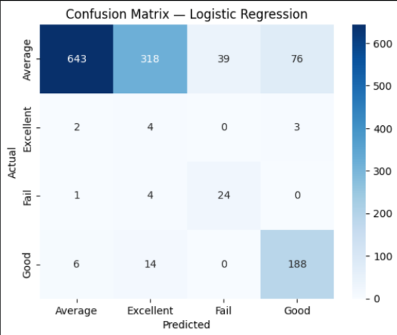
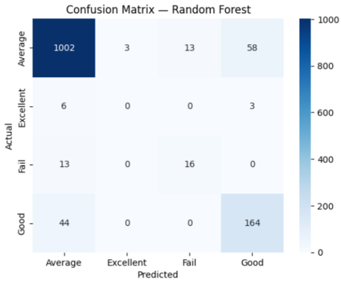
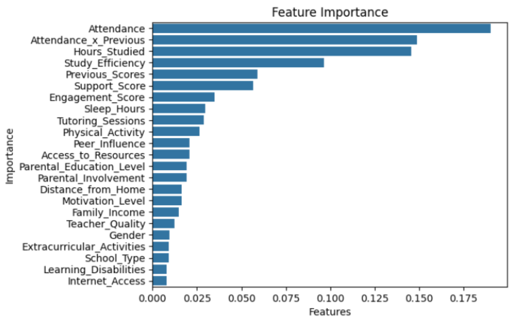
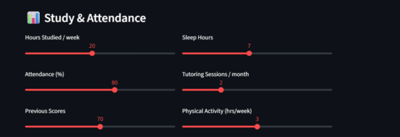
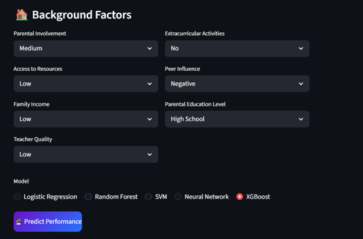
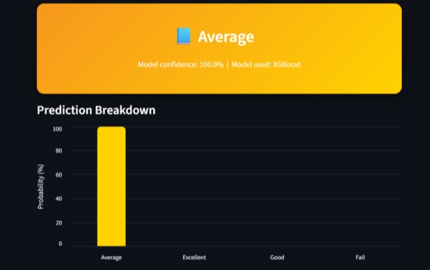

# 🎓 Student Performance Prediction

A machine learning classification project that predicts a student's academic performance category — **Fail / Average / Good / Excellent** — using study habits, attendance, and background factors. Includes feature engineering, class-imbalance handling with SMOTE, a 5-model comparison, SHAP explainability, and a deployed Streamlit web app.

---

## 📋 Table of Contents

- [Project Overview](#-project-overview)
- [Folder Structure](#-folder-structure)
- [Installation Guide](#-installation-guide)
- [Dataset Information](#-dataset-information)
- [Methodology](#-methodology)
- [Results & Screenshots](#-results--screenshots)
- [Running the App](#-running-the-app)
- [Future Improvements](#-future-improvements)

---

## 🎯 Project Overview

| | |
|---|---|
| **Level** | (Week 2 Project) |
| **Objective** | Predict student performance using historical academic data |
| **Models** | Logistic Regression, Random Forest, SVM, Neural Network, XGBoost |
| **Deployment** | Streamlit web application |
| **Explainability** | SHAP (SHapley Additive exPlanations) |

---

## 📁 Folder Structure

```
Student Performance/
│
├── data/
│   └── StudentPerformanceFactors.csv   # raw Kaggle dataset
│
├── models/                             # trained models + preprocessing objects (.pkl)
│   ├── logistic_regression.pkl
│   ├── random_forest.pkl
│   ├── svm.pkl
│   ├── neural_network.pkl
│   ├── xgboost.pkl
│   ├── scaler.pkl
│   ├── encoders.pkl
│   ├── target_encoder.pkl
│   └── selected_features.pkl
│
├── notebook/
│   └── performance_pred.ipynb          # full training pipeline notebook
│
├── screenshots/                        # app + evaluation screenshots (used in this README)
│
├── app.py                              # Streamlit deployment app
├── requirements.txt
└── README.md
```

---

## 🛠 Installation Guide

### Prerequisites
- Python 3.10+
- pip

### 1. Clone the repository
```bash
git clone <your-repo-url>
cd "Student Performance"
```

### 2. Create a virtual environment (recommended)
```bash
python -m venv venv

# Activate it
venv\Scripts\activate        # Windows
source venv/bin/activate     # macOS / Linux
```

### 3. Install dependencies
```bash
pip install -r requirements.txt
```

**`requirements.txt` contents:**
```
pandas>=2.0.0
numpy>=1.24.0
scikit-learn>=1.3.0
xgboost>=2.0.0
imbalanced-learn>=0.12.0
shap>=0.44.0
matplotlib>=3.7.0
seaborn>=0.12.0
altair>=5.0.0
streamlit>=1.28.0
joblib>=1.3.0
```

### 4. Run the notebook (to train models from scratch)
```bash
cd notebook
jupyter notebook performance_pred.ipynb
```
Run all cells top-to-bottom (**Kernel → Restart & Run All**) to regenerate the trained models in `models/`.

### 5. Launch the web app
```bash
# from the project root
streamlit run app.py
```
The app opens automatically at `http://localhost:8501`.

---

## 📊 Dataset Information

| Property | Value |
|---|---|
| **Source** | [Kaggle — Student Performance Factors](https://www.kaggle.com/datasets/lainguyn123/student-performance-factors) |
| **File** | `StudentPerformanceFactors.csv` |
| **Rows** | 6,607 students |
| **Columns** | 20 (19 features + `Exam_Score`) |
| **Target Variable** | `Performance_Class` (derived from `Exam_Score`) |

### Features

| Category | Columns |
|---|---|
| **Study & Attendance** | Hours_Studied, Attendance, Sleep_Hours, Previous_Scores, Tutoring_Sessions, Physical_Activity |
| **Background** | Parental_Involvement, Access_to_Resources, Family_Income, Teacher_Quality, Extracurricular_Activities, Peer_Influence, Parental_Education_Level, Internet_Access, School_Type, Distance_from_Home, Learning_Disabilities, Gender |
| **Engineered** | Support_Score, Study_Efficiency, Engagement_Score, Attendance_x_Previous |

### Target: Exam_Score → Performance_Class

`Exam_Score` is a continuous number (55–101). Since this project uses **classification** models, the score is binned into four classes:

| Class | Exam Score Range | Meaning |
|---|---|---|
| Fail | 0 – 60 | Below passing threshold |
| Average | 60 – 70 | Typical performance |
| Good | 70 – 80 | Above-average performance |
| Excellent | 80 – 101 | Top performance |

> ⚠️ **Class imbalance note:** "Average" dominates the dataset while "Excellent" and "Fail" are comparatively rare. This is addressed during training using **SMOTE** oversampling on the training set only.

---

## 🔬 Methodology

1. **Data Cleaning** — missing values filled with mode, duplicates removed
2. **EDA** — distribution analysis, correlation heatmaps, key relationship plots
3. **Feature Engineering** — 4 new features created:
   - `Support_Score` — combined Parental_Involvement + Access_to_Resources + Family_Income + Teacher_Quality
   - `Study_Efficiency` — Hours_Studied relative to Sleep_Hours
   - `Engagement_Score` — Tutoring_Sessions + Extracurricular participation
   - `Attendance_x_Previous` — interaction between Attendance and Previous_Scores
4. **Encoding & Scaling** — categorical columns label-encoded; all numeric columns standardized
5. **Feature Selection** — top 10 features selected via Random Forest importance ranking (all 4 engineered features made the cut)
6. **SMOTE** — synthetic oversampling of minority classes (training set only)
7. **Model Training** — 5 classifiers trained and compared
8. **Evaluation** — accuracy, per-class precision/recall/F1, confusion matrices
9. **Explainability** — SHAP global feature importance + individual prediction explanations
10. **Deployment** — Streamlit app with live prediction across all 5 models

---

## 📈 Results & Screenshots

### Model Comparison

| Model | Test Accuracy |
|---|---|
| **XGBoost** | **91.6%** 🏆 |
| Random Forest | 89.4% |
| Neural Network | 89.0% |
| SVM | 85.0% |
| Logistic Regression | 65.0% |

> Logistic Regression's accuracy drops noticeably after SMOTE rebalancing — an expected tradeoff, as the model becomes more willing to predict rare classes (Fail, Excellent) instead of defaulting to the majority class, improving minority-class recall at the cost of overall accuracy.

### Confusion Matrices

**Logistic Regression**



**Random Forest**



### Feature Importance (SHAP)



Attendance, Hours_Studied, and the engineered `Attendance_x_Previous` and `Study_Efficiency` features rank among the most influential predictors — confirming the engineered features meaningfully contribute to model decisions.

### App Screenshots

**Study & Attendance input**



**Background Factors input + model selector**



**Prediction output**



---

## 🚀 Running the App

```bash
streamlit run app.py
```

1. Fill in study habits (hours studied, attendance, sleep, etc.)
2. Fill in background factors (parental involvement, resources, etc.)
3. Choose a model — Logistic Regression, Random Forest, SVM, Neural Network, or XGBoost
4. Click **Predict Performance** to see the predicted class and confidence breakdown

---


---

## 📄 License

This project is for educational purposes as part of a Week 2 beginner machine learning curriculum.